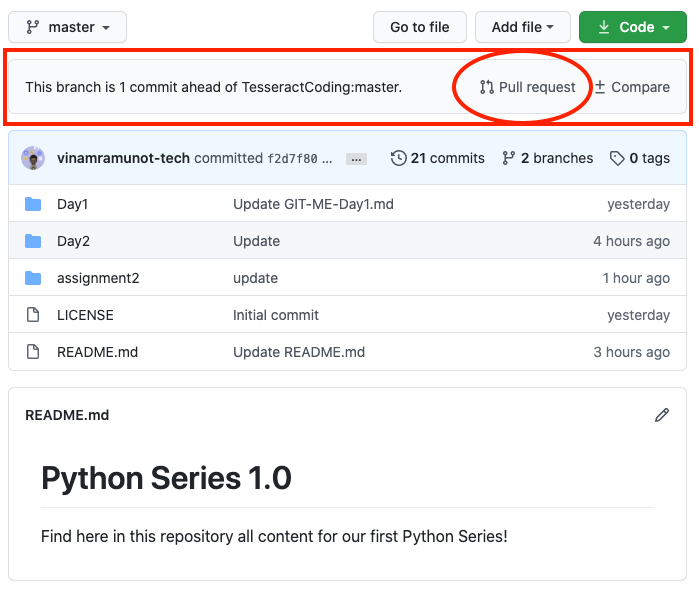
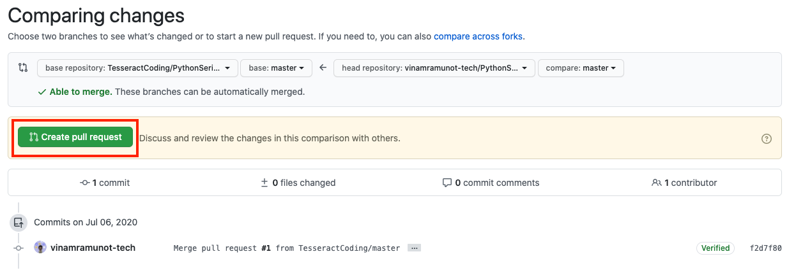
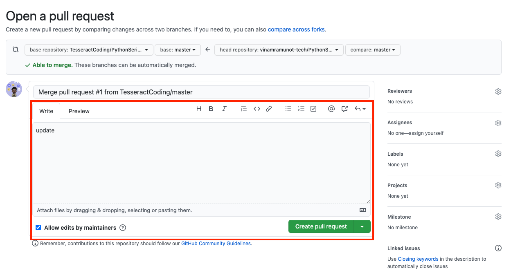

# Assignment 2


## Testing Assignment submission :wink: 
### Fork the repo

  1. SignIn into github.com
  2. Go the https://github.com/TesseractCoding/PythonSeries1.0
  3. On the right corner of the screen click on the fork button
  
<p align="center"></p>
  
  4. The result should look something like this

> The PythonSeries1.0 should be copied to your github

<p align="center"></p>

***

### Go to terminal/powershell

>
> replace "<github username>" with your github username below
```console
git clone https://github.com/<github username>/PythonSeries1.0.git
cd PythonSeries1.0/assignment2
```
> Make the required changes in the assignment 2 folder

```console
git add .
git commit -m "<what ever message you want>"
git push -u origin master
```
***
### Pull Request 

>
> After pushing the code on the master branch, please go back to https://github.com/<github username>/PythonSeries1.0.git. You should be able to see a message on the repo "This branch is 1 commit ahead of TesseractCoding: master..."
>
> Click on the Pull Request
<p align="center"></p>

> Click on Create Pull Request
<p align="center"></p>

> In the "Write Section" write your name "[First Name] [Last Name] Submission" and then create a pull request button
<p align="center">

# :feet: Congrats You are officially Tesseract Coders :octocat:
