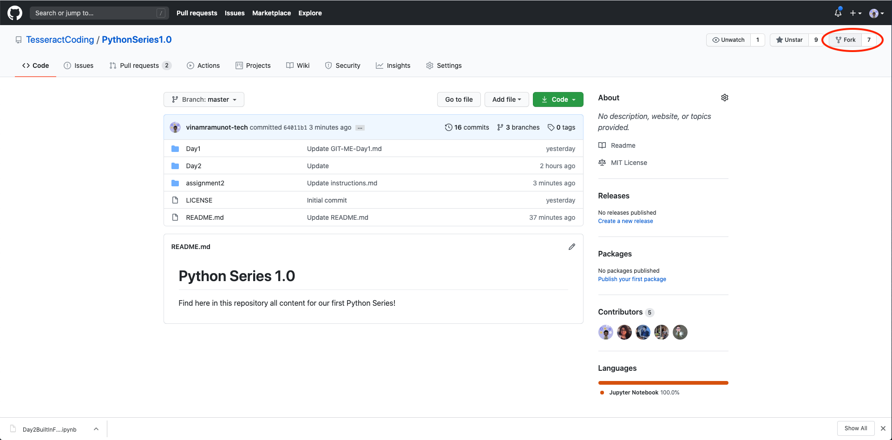
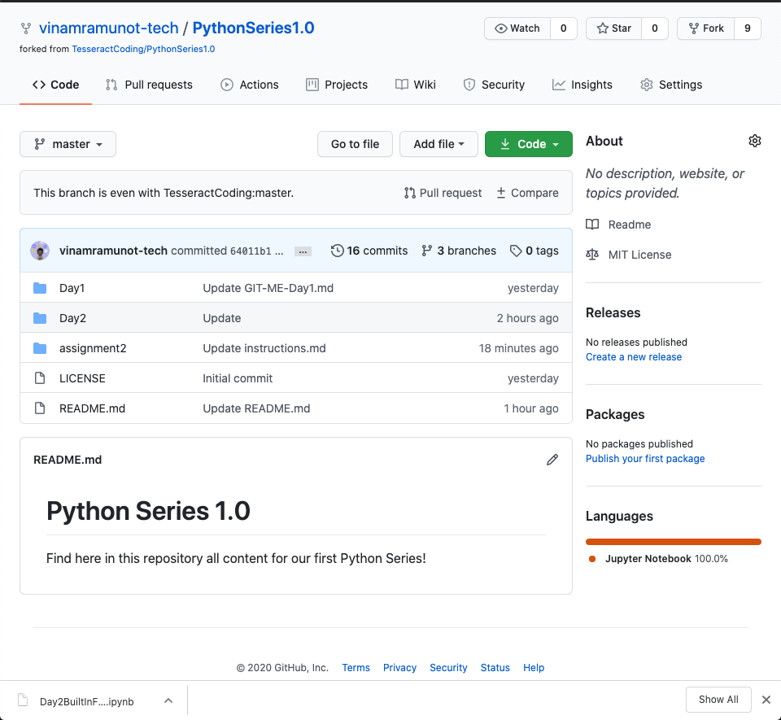

# Assignment 2


### Testing Assignment submission :wink: 
1. Fork the repo
  - SignIn into github.com
  - Go the https://github.com/TesseractCoding/PythonSeries1.0
  - On the right corner of the screen click on the fork button
  
<p align="center"></p>
  
  - The result should look something like this

***

> The PythonSeries1.0 should be copied to your github

<p align="center"></p>


```console
git clone https://github.com/TesseractCoding/PythonSeries1.0.git
cd PythonSeries1.0/Day2/submission_test
git branch <new branch name>[this should be your first and last name, for eg. for me 'Vinamra Munot']
git checkout <new branch name>
```

> makes changes required, this might include making new files, modifying files & deleting files
>
> make a file named "test.py" and write print('hello world')

```console
git add test.py
git commit -m "testing branch changes"
git push -u origin <name of the branch>
```


# :feet: Congrats You are officially Tesseract Coders :octocat:
